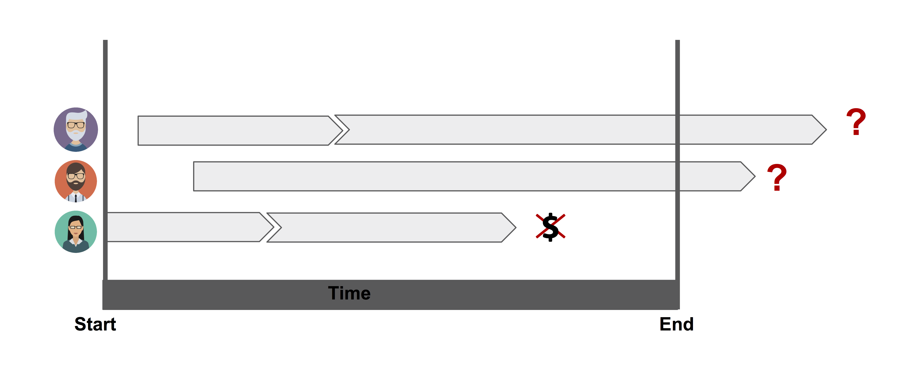
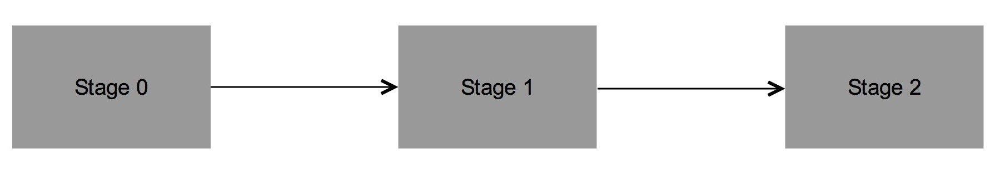
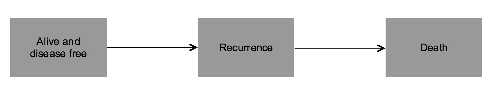

# Conditinal Survival with `condSURV` {#condsurv}


In this chapter we will see  the estimation of the survival function when we have ordered multivariate failure time data. This estimation will be obtained by means of the `condSURV` package, which provides  three different approaches all based on the Kaplan-Meier estimator.


## Introduction


As we saw, the **most popular** method for estimating survival, when there is censoring, is the well-known product-limit estimator also known as **Kaplan-Meier estimator** [@KM58]. The popularity of the product-limit estimator is explained by its simplicity and intuitive appeal while requiring very week assumptions. It simply takes into account with the empirical probability of surviving over certain time. 

**The method does not take into account of covariates**, so it is mainly descriptive. Discrete covariates can be included by splitting the sample for each level of the covariate and applying the product-limit estimator for each subsample. This approach is not recommended for continuous covariates. 

To account to this extra difficulty several generalizations to the Kaplan-Meier estimator have been proposed throughout the last decades. @Beran81 was the first one who proposed an estimator of the conditional distribution (survival) function with censored data in a fully nonparametric way. His estimator was further studied among others by @Dabrowska87, @Akritas94, @Manteiga94 and @VanKeilegom2001. All these estimators can be used to estimate the distribution (or survival) function conditional to a continuous covariable in a regression model, when data are subject to censoring. However, **none of the above** methods can be used to estimate the conditional survival when **the covariate is censored**.

In many longitudinal medical studies, patients may experience **several events** through a follow-up period. In these studies, the analysis of sequentially ordered events are often of interest. The events of concern can be of the same nature (e.g., recurrent disease episodes in cancer studies) or represent different states in the disease process (e.g., 'alive and disease-free', 'alive with recurrence' and 'dead'). If the events are of the same nature, this is usually referred as **recurrent events** [@Cook]. One example of this scheme can be see at Figure \@ref(fig:image).


```{r, "image", fig.cap = "Illustration of censoring.", echo = FALSE, fig.align = 'center', out.width = "80%"}

```


In the above situation maybe we want to obtain estimates for some  conditional survival. Let's do it now!


## Notation


Suppose that an individual may experience $K$ consecutive events at times $T_1<T_2<\cdot\cdot\cdot<T_K=T$, which are measured from the start of the follow-up.


Here different methods are proposed to estimate **conditional survival probabilities** such as $P(T_2 > y \mid T_1 > x)$ or $P(T_2 > y \mid T_1 \leq x)$, where $T_1$ and $T_2$ are ordered event times of two successive events. 

The proposed methods are all **based on the Kaplan-Meier** estimator and the ideas behind the proposed estimators can also be used to estimate more general functions involving **more than two successive event times**. However, for ease of presentation and without loss of generality, we take $K=2$ in this section. The extension to $K>2$ is straightforward.


```{r, "progres", fig.cap = "3-state progresive model.", echo = FALSE, fig.align = 'center'}

```


Let $(T_{1},T_{2})$ be a pair of successive event times corresponding to two ordered (possibly consecutive) events measured from the start of the follow-up.

Let $T=T_{2}$ denote the total time and assume that both $T_1$ and $T$ are observed subject to a (univariate) random right-censoring variable $C$ assumed to be independent of $(T_1,T)$. Due to censoring, rather than $(T_1,T)$ we observe $(\widetilde T_{1},\Delta_1,\widetilde T,\Delta_2)$ where $\widetilde T_{1}=\min (T_{1},C)$, $\Delta_{1}=I(T_{1}\leq C)$, $\widetilde T=\min (T,C)$, $\Delta_{2}=I(T\leq C)$, where $I(\cdot)$ is the indicator function. Let $(\widetilde T_{1i},\Delta_{1i},\widetilde T_i,\Delta_{2i})$, $1\leq i\leq n$ be independent and identically distributed data with the same distribution as $(\widetilde T_{1},\Delta_1,\widetilde T,\Delta_2)$.


## Estimation of the conditional survival

Let $S_1$ and $S$ be the marginal survival functions of $T_1$ and $T$; that is, $S_1(y)=P(T_1>y)$ and $S(y)=P(T>y)$. Introduce also the conditional survival probabilities $P(T>y|T_1>x)$ and $P(T>y|T_1\leq x)$. without loss of generality, we only consider the estimation of $S(y|x)=P(T>y|T_1>x)$.


The Kaplan-Meier estimator, also known as the product-limit estimator, is the most frequently used method to estimate survival for censored data. The most used representation of the Kaplan-Meier estimator of the total time is through a product of the following form

\begin{eqnarray*}
\widehat S(y)=\prod_{\widetilde T_i\leq t}\left(1-\frac{\Delta_{2i}}{R(\widetilde T_i)}\right)
\end{eqnarray*}

\noindent where $R(t)=\sum_{i=1}^{n} I(\widetilde T_i \geq t)$ denote the number of individuals at risk just before time $t$.


Below we introduce a weighted average representation of the Kaplan-Meier estimator which will be used later to introduce estimators for the conditional survival function

\begin{equation*}
\widehat S(y)=1-\sum_{i=1}^{n}W_{i}I(\widetilde T_{(i)}\leq y),%\equiv 1-\widehat{F}_1(x),
\end{equation*}

\noindent where $\widetilde T_{\left( 1\right) }\leq ...\leq \widetilde T_{\left( n\right) }$ denotes the ordered $\widetilde T$-sample and

\begin{equation*}
W_{i}=\frac{\Delta_{2\left[ i\right] }}{n-i+1}\prod_{j=1}^{i-1}\left[ 1-\frac{%
\Delta _{2\left[ j\right] }}{n-j+1}\right]
\end{equation*}

\noindent is the Kaplan-Meier weight attached to $\widetilde T_{\left( i\right) }$. In the expression of $W_{i}$ notation $\Delta_{2\left[ i\right] }$ is used for the $i$-th concomitant value of the censoring indicator (that is, $\Delta_{2\left[ i \right] }=\Delta _{2j}$ if $\widetilde T_{\left( i\right) }=\widetilde T_{j}$).


<br>

Well, we are interested in the estimation of the **conditional survival function, $S(y\mid x)=P(T>y\mid T_1>x)$**. Below we provide estimators for this quantity, all based on the Kaplan-Meier estimator.


### Kaplan-Meier Weighted Estimator (`KMW`)

Since $S(y\mid x)$ can be expressed as $S(y\mid x)=P(T > y|T_1 > x) = 1 - P(T\leq y\mid T_1 > x)= 1 - P(T_1 > x, T\leq y)/\left(1-P\left(T_1\leq x\right)\right),$ the conditional survival function may be estimated as


\begin{equation}
\widehat S^{\texttt{KMW}}(y\mid x)=1-\frac{\sum_{i=1}^{n}{W_iI(\widetilde T_{1\left[i\right]} >x, \widetilde T_{\left(i\right)} \leq y)}}{\widehat S_1(x)}.
\end{equation}


###  The Landmark approach (`LDM`)

The Landmark approach [@vanHouwelingen] states that, given the time point $x$, to estimate $S(y\mid x)=P(T> y\mid T_1>x)$ the analysis can be restricted to the individuals with an observed first event time greater than $x$. 

Let $n_x$ be the cardinal of $\left\{i:\widetilde T_{1i}>x\right\}$ and $\left( \widetilde T_{\left( i\right) }^{x},\Delta_{\left[ i\right]}^{x}\right)$, $i=1,...,n_{x}$, is the $\left(\widetilde T,\Delta\right)$-sample in $\left\{i:\widetilde T_{1i}>x\right\}$\ ordered with respect to $\widetilde T$. 


\begin{equation*}
\widehat S^{\texttt{LDM}}(y\mid x)=1-\sum_{i=1}^{n_x}{W_i^{x}I(\widetilde T_{\left(i\right)}^x \leq y)}.
\end{equation*}

\noindent where $W_i^{x}$ denotes the Kaplan-Meier weight attached to the i-th ordered T-datum, computed from the subsample $\left\{i:\widetilde T_{1i}>x\right\}$.


###   The Presmoothed Landmark approach (`PLDM`)

The standard error of the LDM approach may be large when the censoring is heavy, particularly with a small sample size. Interestingly, the variance of this estimator may be reduced by presmoothing [@Dikta1998]. Here, the idea of presmoothing involves replacing
the censoring indicators (in the expression of the Kaplan-Meier weights) by some smooth fit before the Kaplan-Meier formula is applied. This preliminary smoothing may be based on a certain parametric family such as the logistic (thus leading to a semiparametric estimator), or on a nonparametric estimator of the binary regression curve. The corresponding presmoothed landmark estimator is then given by


\begin{equation*}
\widehat S^{\texttt{PDLM}}(y\mid x)=1-\sum_{i=1}^{n_x}{W_i^{x\star}I(\widetilde T_{\left(i\right)}^x \leq y)}
\end{equation*}

\noindent where $W_{i}^{x\star}$ is defined through


\begin{equation*}
	W_{i}^{x\star}=\frac {m(\widetilde T_{\left(i\right)}^{x})}{n_x-i+1}\prod_{j=1}^{i-1}\left[1-\frac {m(\widetilde T_{\left(j\right)}^{x})}{n_x-j+1}\right], \quad 1\leq i\leq n_{x},
\end{equation*}

\noindent where $\left( \widetilde T_{\left( i\right) }^{x},\Delta_{\left[ i\right]}^{x}\right)$, $i=1,...,n_{x}$,
is the $\left( \widetilde T,\Delta\right)$-sample in $\left\{i:\widetilde T_{1i}>x\right\}$\ ordered with respect to $\widetilde T$.


Here, $m(t)= P(\Delta=1\mid \widetilde T^{x}=t)$. $m(\widetilde T^{x})$ belongs to a
parametric (smooth) family of binary regression curves, e.g., logistic. 


According to the performance, it has been demonstrated that **all of the  estimators perform well**, approaching their targets as the sample size increases. Besides, simulation results reveal that the landmark estimator (`LDM`) perform favorably when compared with the first method (`KMW`). Furthermore, the reported simulation results reveal relative benefits of presmoothing (`PLDM`) in the heavily censored scenarios or small sample sizes.


## The `condSURV` package

To illustrate our methods we will use data from a German Breast cancer study [@book:1506027]. This data set is freely available as part of the `condSURV  package.

In this dataset, a total of 686 woman with primary node positive Breast cancer were
recruited in the period between 1984 and 1989. From this total, 299 developed a recurrence and among these 171 died.

For each patient, the two event times (time to recurrence and time to death) and the
corresponding indicator status is recorded. Other covariates were also recorded. The covariate `recurrence` is the only time-dependent
covariate, while the other covariates included are fixed. Recurrence can be considered
as an intermediate transient state and modeled using a three-state progressive model
with states **Alive and disease-free**, **Alive with Recurrence** and **Dead**. You can see an example at Figure \@ref(fig:breast).


The effect of `recurrence` is important on the patient outcome and can be studied through the ordered multivariate event time data of time-to-event from enrollment, to recurrence and to death. Results obtained from the estimation of the conditional survival probabilities, $S(y\mid x)=P(T>y|T_1>x)$, can be used to understand which individuals without recurring cancer after surgery are most likely to survive from their disease and which would benefit from more personal attention, closer follow-up and monitoring.


```{r, "breast", fig.cap = "Scheme of the model.", echo = FALSE, fig.align = 'center'}

```

Bellow is an excerpt of the data.frame with one row per individual

```{r}
head(gbcsCS)

kmw1 <- survCOND(survCS(rectime, censrec, survtime, censdead) ~ 1,
x = 365, y = 1460, data = gbcsCS, method = "KMW", conf = TRUE, n.boot = 100)

summary(kmw1)
```

With the previous code you can obtain the estimates for the probability that a woman survives more than four years given that she is alive and disease-free at one year after the surgery. Note that the package contains the function `survCS` which takes the input data as an `R` formula and creates a survival object among the chosen variables for analysis. This function will verify if the data has been introduced correctly and create a `survCS` object. Arguments in this function must be introduced in the following order `time1`, `event1`, `time2`, `event2`,..., `Stime` and `event`, where `time1`, `time2`, ..., `Stime` are ordered event times and `event1`, `event2`,..., `event` their corresponding indicator statuses. This function plays a similar role as the `Surv` function in the `survival` package.


```{r}
# including more times
kmw2 <- survCOND(survCS(rectime, censrec, survtime, censdead) ~ 1,
x = 365, y = 365 * 1:7, data = gbcsCS, method = "KMW", conf = TRUE) 

summary(kmw2)


# with y omitted
kmw3 <- survCOND(survCS(rectime, censrec, survtime, censdead) ~ 1,
x = 365, data = gbcsCS, method = "KMW", conf = TRUE)

# note the `times` argument
summary(kmw3, times = c(730, 1095))  
```


In addition, one may also be interested in calculating the conditional survival function, $S(y\mid x)=P(T>y|T_1\leq x)$. This is the probability of the individual to be alive at time $y$ conditional that he/she is alive with recurrence at a previous time $x$.

```{r}
# P(T > y | T1 < x)
kmw4 <- survCOND(survCS(rectime, censrec, survtime, censdead) ~ 1,
x = 365, data = gbcsCS, method = "KMW", conf = TRUE, lower.tail = TRUE) 

summary(kmw4, times = c(730, 1095))
```


Similarly, one can obtain the results for the landmark methods (`LDM` and `PLDM`) using the same function `survCOND`. The unsmoothed landmark estimator is obtained using argument `method = "LDM"` whereas for obtaining the presmoothed landmark estimator the argument `presmooth = TRUE` is also required.


```{r}
plot(kmw3, confcol = "red", xlab = "Time (days)", ylab = "S(y|365)")
```


One important goal is to obtain estimates for the above estimated quantities (conditional survival probabilities) conditionally on current or past covariate measures. The current version of the package allow the inclusion of a single covariate.


```{r}
grade <- survCOND(survCS(rectime, censrec, survtime, censdead) ~ as.factor(grade),
                  x = 365, data = gbcsCS, method = "LDM", conf = FALSE)
plot(grade)
```


Finally, the package also allow the user to estimate the conditional survival given a continuous covariate (i.e., objects of class 'integer' or 'numeric'). For example, estimates and plot for the conditional survival for women aged 60 years, $S(y|x,Z=z)=P(T>y|T_1>x, age=60)$. 


```{r}
age <- survCOND(survCS(rectime, censrec, survtime, censdead) ~ age, x = 365, 
                z.value = 60, data = gbcsCS, conf = FALSE)
plot(age)
```


```{block2, type = "rmdhint_sestelo"}
The **inclusion of continuous covariates** can be computationally demanding. In particular, the use of bootstrap resampling techniques are time-consuming processes because it is necessary to estimate the model a great number of times. 
```


The use of the `condSURV` package to more than two consecutive events is illustrated in the Appendix of @meiramachado-sestelo:2016.


